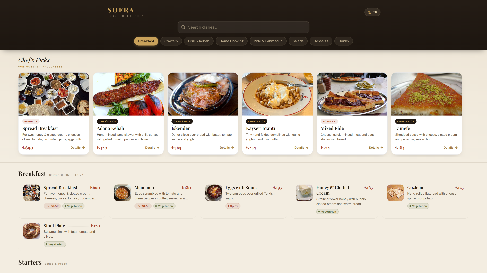
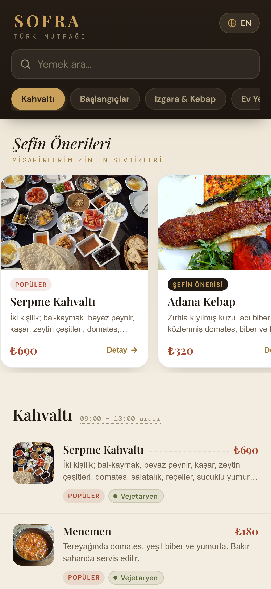
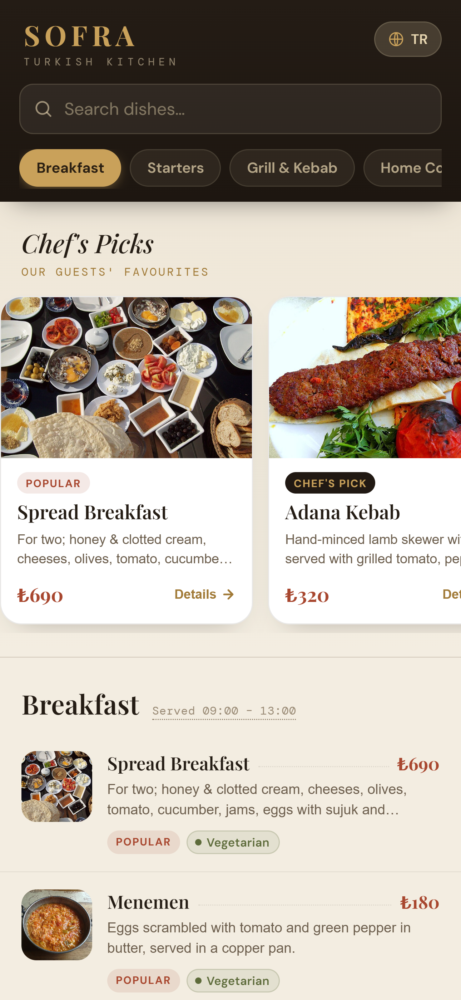
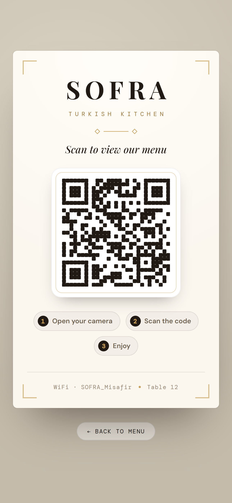

# SOFRA · QR Menü / QR Menu

**TR** — Tam kapsamlı bir Türk restoranı için QR ile açılan dijital menü. TR/EN dil desteği, mobil + masaüstü responsive. **Vite + React + TypeScript** ile geliştirilmiştir.

**EN** — A QR-based digital menu for a full Turkish restaurant. Bilingual (TR/EN), responsive on mobile and desktop. Built with **Vite + React + TypeScript**.

## Ekran Görüntüleri / Screenshots

### Masaüstü / Desktop


### Mobil / Mobile
| Türkçe | English |
|---|---|
|  |  |

### QR Poster


## Hızlı başlangıç / Quick start

```bash
npm install
npm run dev      # geliştirme sunucusu / dev server  -> http://localhost:5280
npm run build    # üretim derlemesi / production build -> dist/
npm run preview  # derlemeyi yerelde sun / preview      -> http://localhost:4280
```

**TR** — Menü hem mobilde (telefon genişliğinde tam ekran) hem masaüstünde (geniş, ortalı, çok kolonlu ızgara; detay ekran ortasında modal) responsive çalışır.

**EN** — The menu is fully responsive: full-screen phone column on mobile, wide centered multi-column grid on desktop with a centered detail modal.

## Rotalar / Routes

| Rota / Route | Açıklama / Description |
|---|---|
| `/` (veya/or `/menu`) | Telefon menüsü / The main guest-facing menu |
| `/poster` | Masa 12 için QR poster / QR poster for table 12 |
| `/poster/:masa` | Masa bazlı QR poster / Per-table QR poster (ör./e.g. `/poster/7`) |

**TR** — QR kod, posterin barındığı origin'i `?masa=N` parametresiyle kodlar; dağıtımda otomatik olarak doğru menü URL'ini gösterir.

**EN** — The QR code encodes the poster's own origin with a `?masa=N` parameter, so it always points to the correct deployed menu URL.

## Özellikler / Features

- **TR / EN dil değişimi** — anlık, seçim `localStorage`'da kalıcı. / **TR / EN switch** — instant, persisted in `localStorage`.
- **Sticky kategori sekmeleri + scrollspy** — kaydırınca aktif kategori vurgulanır. / **Sticky category tabs + scrollspy** — active category highlights on scroll.
- **Arama / Search** — Türkçe-duyarlı (`toLocaleLowerCase("tr")`) ad + açıklama filtresi. / Turkish-aware name + description filter.
- **Şefin Önerileri / Chef's Picks** — `featured` ürün carousel'i. / `featured` items carousel.
- **Detay alt-sayfası / Detail sheet** — diyet/alerjen etiketleri + sembolik "Siparişe Ekle". / diet/allergen tags + symbolic "Add to Order".
- **Erişilebilirlik / Accessibility** — `<button>` hedefleri, `aria-label`'lar, `prefers-reduced-motion`, `env(safe-area-inset-*)`.

## Klasör yapısı / Project structure

```
src/
  components/   Tag, Pin, Photo, FeatureCard, ItemRow, DetailSheet, MenuScreen, QRPoster
  pages/        MenuPage, PosterPage
  lib/          types.ts · menu.ts · strings.ts · format.ts · i18n.tsx
  styles/       tokens.css · components.css
  App.tsx       rotalar / routes
  main.tsx      giriş noktası / entry (BrowserRouter + LangProvider)
```

## İçerik düzenleme / Editing content

- **Ürün / fiyat / kategori — Items / prices / categories:** `src/lib/menu.ts` (`ITEMS`, `CATEGORIES`, `TAGS`, `IMAGES`).
- **Arayüz metinleri — UI strings:** `src/lib/strings.ts` (`STRINGS.tr` / `STRINGS.en`).
- **Renk / tipografi token'ları — Design tokens:** `src/styles/tokens.css`.

**TR** — Ürün adı `itemName(item, lang)`, açıklama `itemDesc(item, lang)` ile okunur. Yeni dil eklerken bu yardımcıları ve `Strings` tipini genişletin.

**EN** — Item name is read via `itemName(item, lang)` and description via `itemDesc(item, lang)`. To add a language, extend these helpers and the `Strings` type.

## Sonraki adımlar / Roadmap

**TR** — İstenirse eklenebilecek kapsam: gerçek sipariş/sepet, masa oturumu, stok/uygunluk rozeti, admin paneli, analitik.

**EN** — Optional scope to add later: real ordering/cart, table sessions, out-of-stock badges, admin panel, analytics.
